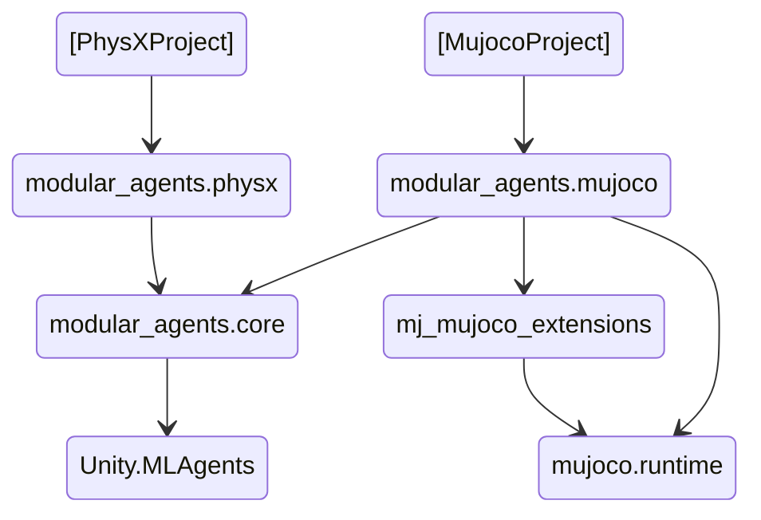
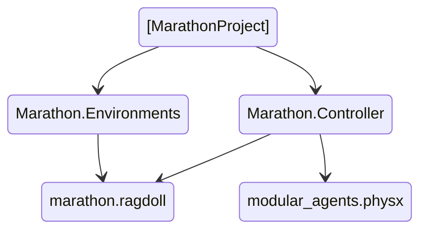
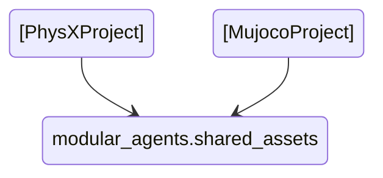

# Modular Agents

The Modular Agents packages extend the functionality of the [ML-Agents Toolkit](https://github.com/Unity-Technologies/ml-agents) with template components for building Reinforcement Learning scenes in Unity. 
The goal of the package is to provide components that speed up the creation of environments and their different variations. Flexible interfaces between components are used to allow customizing behaviour without 
needing to repeat code, but to provide additional structure when designing new learning conditions.

The current organization of packages is as follows:

A part of the older [`marathon project`](TODO)  also uses *modular agents* packages. This is, specifically, the *Marathon Controller* folder. 

**Optionally** it is also possible to import some Ragdolls, Skins and materials that help defining new training environments. They work both in PhysX and mujoco:

### 

# TODO

# events and handlers in Modular Agents

There are 2 kinds of objects:

- events ...

- handlers ...

It is important that they can subscribe to a list of each other... (one handler can be triggered by several events, and one event can trigger several handlers)

### Generic events:

Simple Examples:

**CollisionTrainingEvent** is a simple event that is triggered when there is a collision of the objects

**PositionsDivergedEvent** is anotehr simple event that is triggered...

**ConstantRewardAssignerHandler**  just adds a constant reward every time it is triggered.

### Humanoid Events:

**Basic Setup Handler** ensures that there is a chain of articulation and a reference kinematic rig.

### Meta events:

These events help connect different events between them. For example, they can be used to schedule events that will occur later (**ScheduleWrapHandler**), to trigger an event every N times of occurrence of another event (**CounterHandlerWrapper**)

### Examples:

ctrstepevent -> couterEvent -> cycleWrapEvent

todo

first example (continuous walking movement)

EpisodeBegin triggers ResetEnvironment

then explain why

EpisodeBegin triggers ResetScheduling, which enables the connection between MjPReEvent and ResetEnvironment
