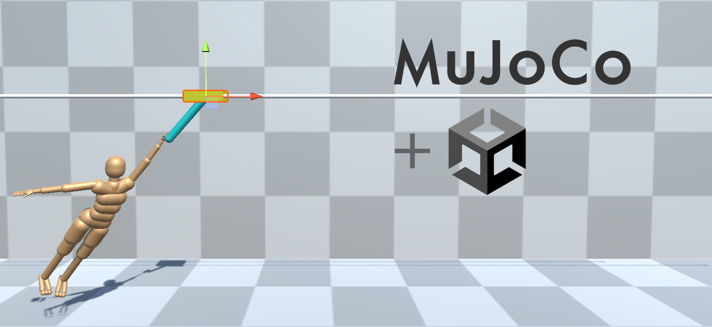
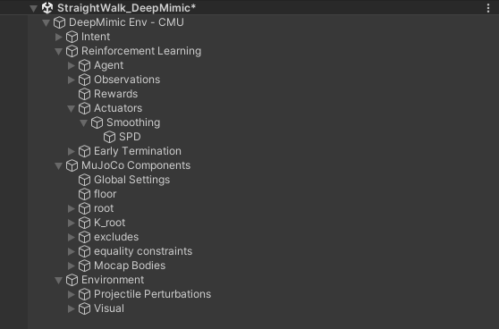

# MuJoCo RL Environments in Unity

This example project provides scenes built in Unity using the Modular Agents extensions of ML-Agents, controlled by RL policies. 
The target audience of this is hands-on users and researchers who want to build their own custom humanoid control environments, but are looking for a starting point.

## Environments:

1. **Cartpole**: A scene with the goal inverting a pendulum (pole) attached to a moveable platform (cart). This is a [classic control problem](https://en.wikipedia.org/wiki/Inverted_pendulum), 
   included as a simplified example for using the MuJoCo plugin in Unity with ML-Agents. An interactive tutorial dedicated to getting started with ML-Agents and MuJoCo is available at this repository: [mj-unity-tutorial](https://github.com/Balint-H/mj-unity-tutorial).

2. **Range Of Motion**: A scene without any RL components, demonstrating [Proportional-Derivative (PD)](https://en.wikipedia.org/wiki/PID_controller) control on a humanoid character in the MuJoCo physics engine.
   PD control is a common way for controlling humanoids, which instead of interpreting agent actions as torques or forces applied on the character, interprets them as target poses, which the PD controller smoothly tracks.
   The humanoid is adapted from the DeepMind Control suite's [CMU humanoid walker](https://github.com/deepmind/dm_control/blob/main/dm_control/locomotion/walkers/assets/humanoid_CMU_V2020.xml), with the hip, lowerback, neck and shoulder joints replaced with ball joints, and realigned to a T-Pose by default.

3. **Walk**: Steady-state walking environments trained with the DeepMimic or with DReCon algorithms. A policy trained with AMP is also included, but the training environments and the custom ML-Agent trainer plugin for it will be published in a future release.

## Kinematic reference motion

For reference based PD control, calculating tracking accuracy for rewards, or collecting observations from the reference animation, the kinematics of the animation need to be converted to the same format as in the MuJoCo simulation. The biggest differences are that MuJoCo expects generalized joint coordinates, where the number of and direction of DoF axes may not align with the default animation data. 
There are several potential ways to handle this. You could precalculate the joint kinematics and store them in a MuJoCo specific animation file (which is how some environments in the DeepMind control suite handle this). The state can then be queried (potentionally interpolated) and updated from this file during simulation time. Alternatively, you could calculate the joint kinematics as needed, which is more appropriate for dynamic kinematic controllers (like the original DReCon).

We plan to explore both options in the near future as systems in the MuJoCo package of modular-agents, however at the moment we use a third approach. 
The "puppeteering" approach uses equality constraints to attract each body part of a second humanoid to the corresponding segment in the reference animation. The joint space kinematics are resolved on their own in this case, and can be compared directly with the main, controlled humanoid.
It also works well with dynamic kinematic controllers (like motion matching).

## Structure of humanoid environments

The unity scene hierarchies are composed in the following way:

- **Intent**: This element collects the reference animation controller, components that update the state of the reference animation and the MuJoCo simulation (`MjKinematicRig`), and any high-level intent signal (simple example is the `AnimationReplayController` that provides a desired walking speed to DReCon). Contains a humanoid avatar in Unity's standard on which animations can be retargeted.
- **Reinforcement Learning**: All components that involve ML-Agents. If disabled,the character will collapse as if it was just a regular MuJoCo scene.
  - **Agent**: Contains a `ModularAgent`, and its RL Signal components (`ObservationSignal`, `ActuatorSignal` and `RewardSignal`). For more information, see the [RL-Signal Readme in the ModularAgents package](<../modular-agents/core/Runtime/RL Signals/README.md>).
    - **Synchronisation**: When exactly within the [simuation loop](https://mujoco.readthedocs.io/en/latest/programming/simulation.html#simulation-loop) the control step takes place can have a large impact on the stability of controllers, and can change the amount of information available to the agent and affect its performance. 
      Therefore, to strictly control when this happens, we use the `EnvironmentStepEventHandler` behaviour here. It has a reference to a control event exposed by the MuJoCo scene. This event is called after the kinematics for the step have been calculated, but before forward dynamics is performed.
  - **Observations**: Collects individual `ObservationSource`s that are referenced by the agent's `ObservationSignal`.
  - **Rewards**: Same, but with `RewardSources` and `RewardsSignal`s.
  - **Actuators**: Similar to the two above, except the inputs to the main `SPDActuatorComponent` (the main `ActuatorComponent`), are first pre-processed by `SmoothedActuator` which wraps around `SPDActuator`. This way the actions of the agent are low-pass filtered, which reduces high-frequency "trembling" movment.
  - **Early Termination**: Collects `TrainingEvent` components and their handlers necessary to detect when an episode should prematurely end. Reasons might include contact with the ground with a non-foot bodypart, or collecting rewards below a threshold. 
    When any of these condition met, the episode will be ended. The episode is also ended if agent survives for a number of steps specified in its `MaxSteps` field (if set to 0, no maximum is set).
    On the decision step that follows termination a new episode will begin, at which point the `EpisodeBeginEvent` is triggered. This event is paired with a handler (`MjBasicSetupHandler`) that resets the controlled humanoid to the state of the reference humanoid.
    For more information on the Training Event system see the [Readme in the corresponding directory](<../modular-agents/core/Runtime/Training Event System/README.md>).
- **MuJoCo components**:
  - **Global Settings**: Settings for the physics simulation (e.g. selecting integrator type, setting gravity, disabling sliding, etc.). 
  - **floor**: Collider for contacts with the ground. Softness of the ground can be set here as well, on the MuJoCo plugin's MjGeom component.
  - **root**: Root body of the controlled dynamic humanoid. Contains all rigid bodies, their colliders and degrees of freedom.
  - **K_root**: 1:1 replica of the dyanmic humanoid, manipulated by [weld constraints](https://mujoco.readthedocs.io/en/latest/XMLreference.html#equality-weld) to match the reference animation. The kinematics of this ragdoll are queried by the RL signals for reference. Collisions of the MuJoCo colliders are disabled.
  - **excludes**: Manually disabled collisions in overlapping colliders in the upper-body.
  - **equality constraints**: The equality constraints that force the reference humanoid to follow the animation.
  - **Mocap Bodies**: The equality constraints used can only work between two MuJoCo rigidbodies. For this reason [`MjMocapBody` components](https://mujoco.readthedocs.io/en/latest/modeling.html?highlight=mocap%20body#mocap-bodies) are used to keep track of the animated transforms. 
    In summary, the reference humanoid movement is generated as follows: 
    - Unity updates the animation avatar's transforms.
    - `MjKinematicRig` copies the transforms of the animated avatar to the corresponding `MjMocapBody` objects.
    - The `MjWeld` equality constraints force each `MjBody` of the reference humanoid to match the corresponding `MjMocapBody`.
    - The target state can now be queried from the reference humanoid.
- **Environment**:
  - **Projectile Perturbations**: Using the Training Event system, a way to launch projectiles at the simulated humanoid is implemented. None of the trained policies have been trained with these perturbations, but this can be used to assess performance of policy with robustness in mind in addition to animation quality.

## Tips for editing scenes:

- You can add many components simultaneously to a serialized list in the inspector by locking the inspector with the button in the top right corner, selecting all objects to be added in the hierarchy, (with Ctrl or Shift + Left mouse), then drag-and-dropping them on the list.

## Training policies:

- We recommend that for using the ML-Agents package, you [make a build](https://github.com/Unity-Technologies/ml-agents/blob/main/docs/Learning-Environment-Executable.md) 
  of your scene instead of running the learning from the editor, unless you are debugging an issue that only seems to happen during training.
- A [config file](https://unity-technologies.github.io/ml-agents/Training-Configuration-File/) is provided in the same directories as the scenes themselves. Command line arguements used to launch trainings are stored in `cli_args.txt` in the same folders. 
- Don't forget to always test an environment in the Editor
  before running a training with it, to identify potential errors you might
  have made. To debug your components you may want to use the various tools
  available in Unity. You may create visualisations using Gizmos, or plot
  different values in real time through packages such as <a href="https://assetstore.unity.com/packages/tools/gui/debuggui-graph-139275">DebugGUIGraph</a>.
- Make sure the right episode length is specified in the agent's MaxStep field.

## Planned additions:

- Additional control learning envrionments.
- Task oriented environments (e.g. throwing, user directed movement).
- More challenging environments (e.g. diverse locomotion, stair ascension/descension).
- Motion matching kinematic controllers.
- Tools for scaling humanoid characters.
- Streamlining new environment construction and customization to novel characters.
- Additional guidance on building scenes.
