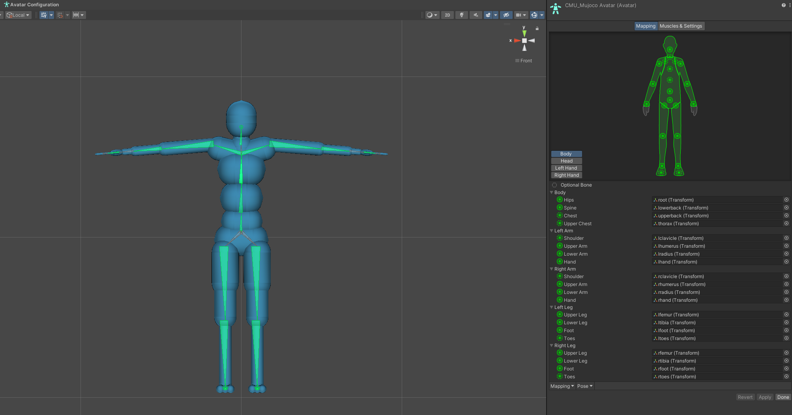

# MuJoCo Humanoid Scaling

These editor scripts were made to adjust the existing CMU humanoid model (or humanoids similar to it) to match in dimensions a [Unity Mecanim](https://docs.unity3d.com/Manual/AnimationOverview.html) avatar. 
This way animations (originating from mocap or keyframed) will be more appropriate for the simulated humanoid the agent controls without needing significant retargeting.

For this end, these scripts rely on the [Unity FBX exporter](https://docs.unity3d.com/Packages/com.unity.formats.fbx@2.0/manual/index.html) package. With it you can export Mecanim compatible avatars from MuJoCo humanoids, which make the mapping between
other avatars in the Mecanim format much easier. The exported avatar can also be animated with Mecanim, giving reference motion queryable and visualized during play mode.

The scaling functionality is still in its early stages, and contributions refining it and extending it are welcome. The feature is in two files:
- `Scaling.cs` contains most of the backend logic. It introduces the concept of a `ScalingSegment`, which spans one or more MuJoCo boides, starting at the origin of a mecanim bone, and ends in the parent body of the following Mecanim bone. 
  The goal of the scaling scripts is to match the length of `ScalingSegment`s with the distance corresponding to the Mecanim bones in the reference avatar.

- `MjScalingEditorWindow.cs` defines the user interface for opening this tool, taking in user parameters, constructing the `ScalingSegment`s, finding the corresponding length information from the reference avatar and calling the scaling operations.

## Assumptions / Requirements
- All joints of a body are coincident.
- Joints are coincident with body frame.
- Joints axes are aligned with the longitudinal axis of a body connecting it to its child body, or are orthogonal to it.
- Capsules, boxes, cylinders are all aligned with the longitudinal segment axis, or with the orthogonal plane.
- Only longitudinally and uniformly in orthogonal directions are scaled (anatomical pose unchanged by scaling).
- End effectors have a site marking the end of their segment.
- Assume that branching bodies are only in the trunk and aligned with the global vertical direction.

## Usage
### Step 1: Setting up a new source humanoid
1. Import the MuJoCo humanoid into a new scene through the [XML importer](https://mujoco.readthedocs.io/en/latest/unity.html#using-the-plug-in).
2. Configure the humanoid into a T-pose.

   

3. Export a FBX model from the parent GameObject of the root body segment.
 
   

4. Configure the exported avatar to use the Mecanim humanoid format, and edit it to ensure correct mapping between body segments.
   
   

5. Double check the mapping, fixing incorrect default assignments. Common issues might be in associating wrong bodies with hands and neck. Optionally remove finger mapping.
   
   

6. [Export a prefab asset](https://docs.unity3d.com/Manual/CreatingPrefabs.html) of your humanoid in your Scene. That prefab will house all the MuJoCo components, while the FBX is used only for the reference Mecanim mapping, and to be animated by motion clips.

A source humanoid and its Mecanim avatar is available in the [MuJoCo example project](https://github.com/Balint-H/modular-agents/tree/main/UnityMjExamples) of the Modular Agents package.

### Step 2: Scaling source humanoid to match a target reference avatar
1. Add your MuJoCo humanoid prefab to a scene.
2. Find the target humanoid's FBX file. Make sure its also set up in Humanoid mode, and that the mapping is correct.
3. Select *Tools > Scale MuJoCo Humanoid* in the top toolbar.
4. Assign the *Reference Avatar*, *Reference Root*, *MuJoCo Avatar* and *MuJoCo Humanoid* fields in the opened Editor window.

|Property name|Description| 
|---|---|
|Reference Avatar|Avatar of the target humanoid,the segment lengths of which will be copied to the MuJoCo humanoid. Contains information about how the transforms of the character map to the Mecanim Humanoid format.|  
|Reference Root|Each humanoid FBX asset contains the avatar asset, and the root object asset if you expand it. The root object contains information about parent-child relationship of the bones. |   
|MuJoCo Avatar|Avatar in the FBX asset exported in Step 1.|
|MuJoCo Humanoid|The free joint of the root body in the humanoid currently in scene.|

5. Check with the visualization tools (*Show* toggle buttons) that the segments, their parenting and length have been interpreted correctly.
6. Set how you want end effector scaling handled, optionally set the desired total mass of the human, and set how should segment thickness be scaled based on the length scaling.
7. Click `Scale Humanoid` to apply the scaling. The operation is not Undo-tracked, so make sure to work on a copy of the humanoid, or that you have a prefab saved. 

Information/explanation regarding each of these fields is available as tooltips when you hover over their labels. Hovering over the name of the visualized segments in the Scene view will also bring up a tooltip containing information about which bones does that segment connect, and its length.

### Other tips
- For animator components, set their [Update Mode](https://docs.unity3d.com/ScriptReference/AnimatorUpdateMode.html) in the inspector to "Animate Physics". This way the motion will be updated with the physics step in sync. 
  This way velocity and other measures estimated from the refernce measures will be up to date and not suffer from aliasing.
- You can make adjustments to the avatar of either the reference or the MuJoCo avatar by clicking "Configure Avatar" in the inspector (e.g. to adjust a bone location in the reference avatar to match the structure of the MuJoCo humanoid better). 
- This may be necessary if there's a fundamental mismatch on where the origin of a segment should be (most likely to be in the root, as the free joint's location is not anatomically defined).
- For people shorter than the original MuJoCo humanoid, "orthogonal ratio" should be higher than for taller people.

## Implementation Details
- All direct child components on a body are scaled linearly. The scaling is not uniform, it's separated into longitudinal (aligned with the segment axis) and orthognal (all perpendicular directions to the segment axis) scaling.
  Skewed scaling is not implemented to preserve the use of primitve Geoms.
- Because orthogonal directions are scaled uniformly, condyloid-like (2 Dof) joints don't need to change their axes if they are aligned with the body.
- Joints are not rotated, only moved through moving their parent bodies. This means the reported joint angles in the anatomical pose will remain the same.
- The desired length for a scaling segment is determined from the reference avatar hierarchy, as the distance between two related Mecanim bones. 
  This length is divided by the distance between the `MjBody`s that start the corresponding mecanim bones in the avatar exported from the MuJoCo humanoid.
- Some `MjBody`s will be present in multiple `ScalingSegment`s (mostly due to mismatch at which body does a Mecanim avatar and a MuJoCo humanoid branch). These segments would want to scale the body in different directions and with different amount.
  To reconcile this, the final scaling will be in the average direction and magnitude requested by `ScalingSegment`s, weighted by how well the direction is aligned with the geoms of the body (based on a dot product).
- End effectors can be scaled based on end bones in the reference if they exist (with a naming convention of having the "End" substring, Alternatively we can inherit the scaling of the parent.
- The orthogonal scale is determined from the longitudinal scale (lacking segment thickness information from the unskinned avatar). The "orthogonal ratio" parameter controls this, which linearly scales the orthogonal scale factor from 1 (no scaling) to the longitudinal scaling. 

