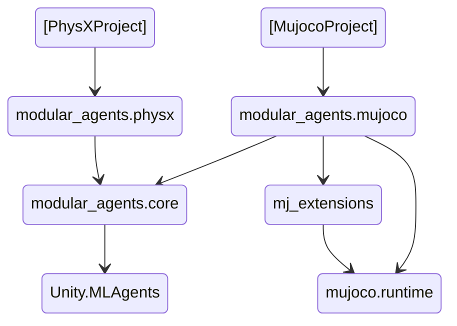
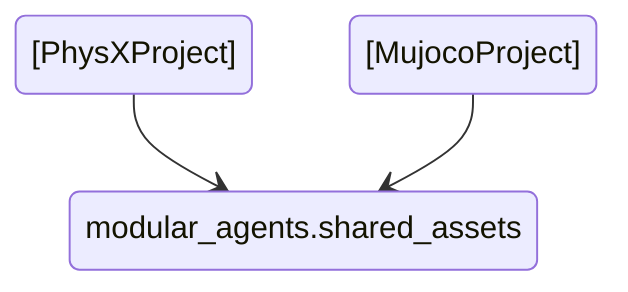

# Modular Agents

The Modular Agents packages extend the functionality of the [ML-Agents Toolkit](https://github.com/Unity-Technologies/ml-agents) with template components for building Reinforcement Learning scenes in Unity. 
The goal of the package is to provide components that speed up the creation of environments and their different variations. Flexible interfaces between components are used to allow customizing behaviour without 
needing to repeat code, but to provide additional structure when designing new learning conditions. For humanoid control only environments with the MuJoCo physics engine have been tested. 
The PhysX implementations should be considered to be in pre-alpha state, released for those who would be interested in being actively involved in its development.

The current organization of packages is as follows:

**Optionally** it is also possible to import some Ragdolls, Skins and materials that help defining new training environments. They work both in PhysX and MuJoCo:

For getting started with the package we recommend exploring the example Unity projects we have (starting with the MuJoCo one). The Readme-s of the [RL Signal scripts](<core/Runtime/RL Signals/README.md>) and the [Training Event system](<core/Runtime/Training Event System/README.md>) summarize the general additions of the package and their relationships.
Further information specific to locomotion environments, as well as training policies is available in the Readme-s of the [example projects](../UnityMjExamples/README.md). Lastly, we also recommend familiarising yourself with the [ML-Agents toolkit's documentation](https://unity-technologies.github.io/ml-agents/).
